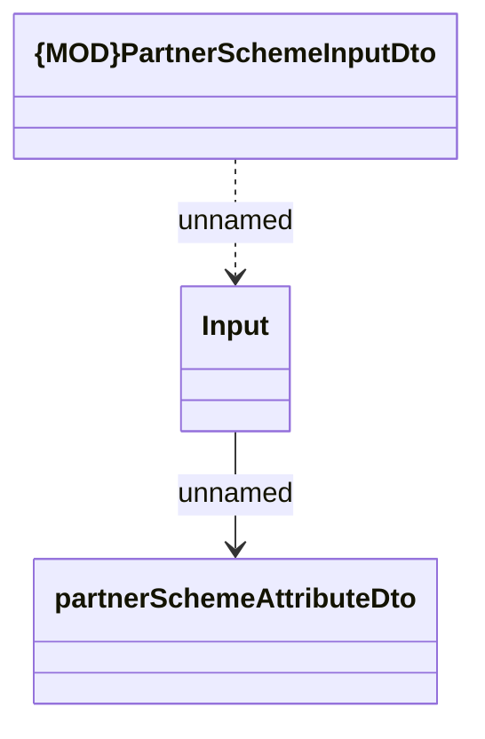

# Partner Scheme Input

- **Diagram Type**: Logical
- **Package**: HomerSelect/BSL/Modules/Commodity/Interface Provided/Commodity API/Partner Scheme
- **Diagram ID**: 158946
- **Elements**: 3
- **Connectors**: 2

