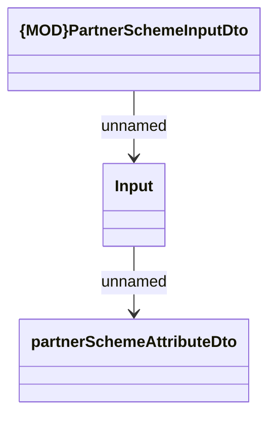

# Partner Scheme Input

```mermaid
classDiagram
    class partnerSchemeAttributeDto["partnerSchemeAttributeDto"]
    class Input["Input"]
    class MOD_PartnerSchemeInputDto["{MOD}PartnerSchemeInputDto"]
    MOD_PartnerSchemeInputDto --> Input : unnamed
    Input --> partnerSchemeAttributeDto : unnamed
```
