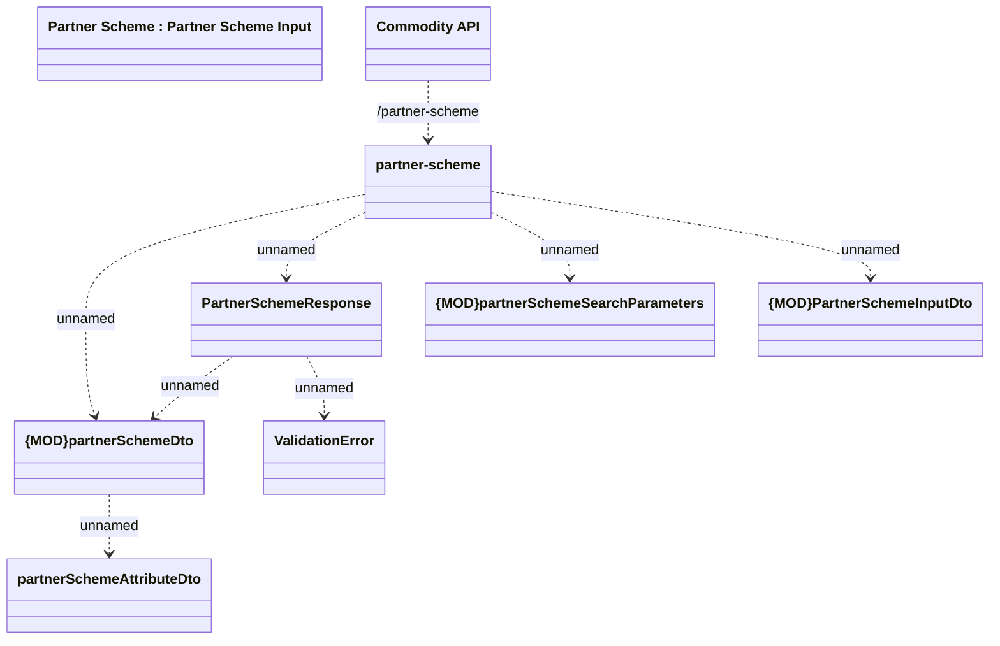

# Partner Scheme

- **Diagram Type**: Logical
- **Package**: HomerSelect/BSL/Modules/Commodity/Interface Provided/Commodity API/Partner Scheme
- **Diagram ID**: 158944
- **Elements**: 9
- **Connectors**: 8

