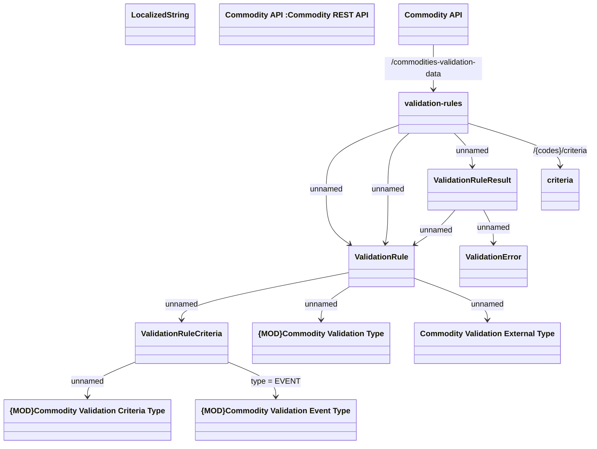

# Validation Rule

```mermaid
classDiagram
    class criteria["criteria"]
    class Commodity_Validation_External_Type["Commodity Validation External Type"]
    class MOD_Commodity_Validation_Event_Type["{MOD}Commodity Validation Event Type"]
    class MOD_Commodity_Validation_Type["{MOD}Commodity Validation Type"]
    class MOD_Commodity_Validation_Criteria_Type["{MOD}Commodity Validation Criteria Type"]
    class ValidationRuleCriteria["ValidationRuleCriteria"]
    class LocalizedString["LocalizedString"]
    class ValidationError["ValidationError"]
    class ValidationRuleResult["ValidationRuleResult"]
    class ValidationRule["ValidationRule"]
    class validation_rules["validation-rules"]
    class Commodity_API_Commodity_REST_API["Commodity API :Commodity REST API"]
    class Commodity_API["Commodity API"]
    validation_rules --> ValidationRule : unnamed
    validation_rules --> ValidationRule : unnamed
    ValidationRuleResult --> ValidationRule : unnamed
    validation_rules --> ValidationRuleResult : unnamed
    ValidationRuleResult --> ValidationError : unnamed
    ValidationRule --> ValidationRuleCriteria : unnamed
    ValidationRuleCriteria --> MOD_Commodity_Validation_Criteria_Type : unnamed
    ValidationRule --> MOD_Commodity_Validation_Type : unnamed
    ValidationRuleCriteria --> MOD_Commodity_Validation_Event_Type : type = EVENT
    ValidationRule --> Commodity_Validation_External_Type : unnamed
    validation_rules --> criteria : /{codes}/criteria
    Commodity_API --> validation_rules : /commodities-validation-data
```
