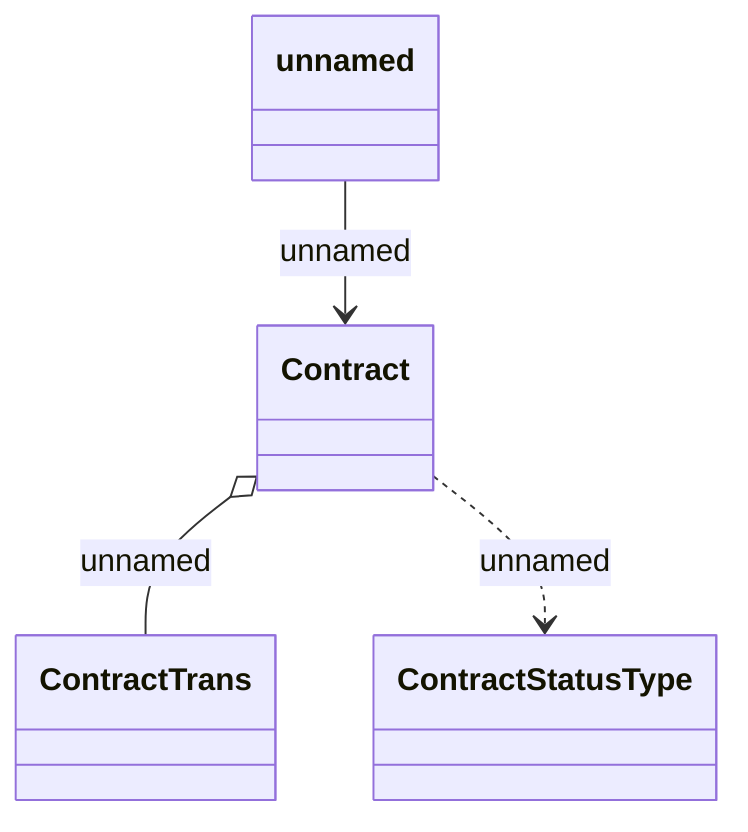

# Job parameters

- **Diagram Type**: Logical
- **Package**: HomerSelect/BSL/Modules/Contract Management (COMA)/Analytical Model/Contract Operations/Contract Archivation/Logical Data Model
- **Diagram ID**: 156327
- **Elements**: 4
- **Connectors**: 3

