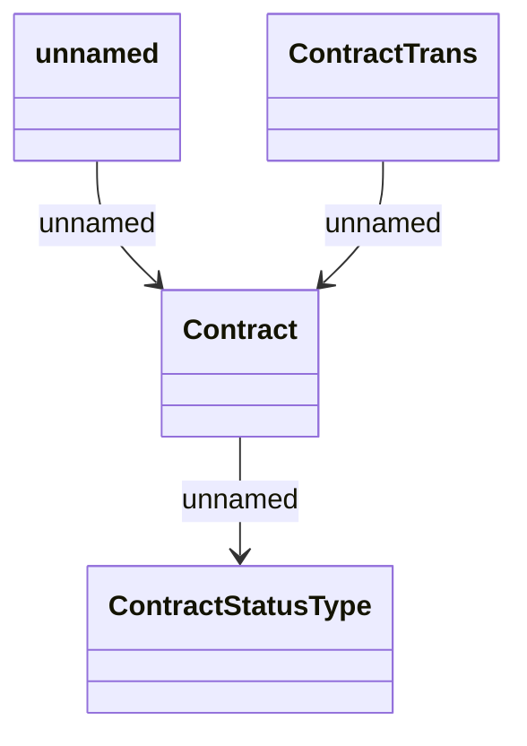

# Job parameters

```mermaid
classDiagram
    class ContractStatusType["ContractStatusType"]
    class ContractTrans["ContractTrans"]
    class Contract["Contract"]
    unnamed --> Contract : unnamed
    ContractTrans --> Contract : unnamed
    Contract --> ContractStatusType : unnamed
```
