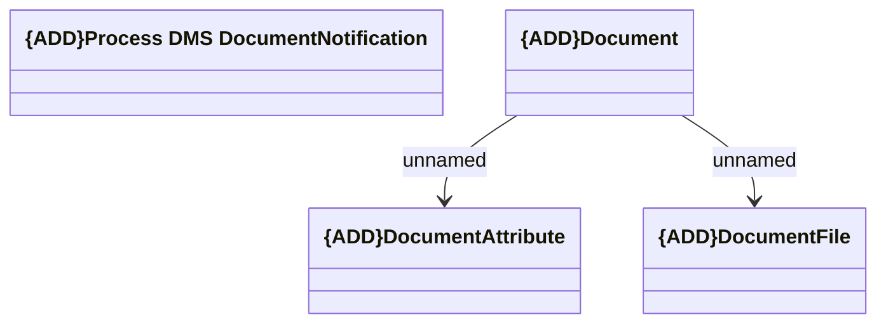

# Document notification (DMS)

- **Diagram Type**: Logical
- **Package**: HomerSelect/BSL/Modules/Contract Management (COMA)/Interface Consumed/Kafka/Document (DMS)
- **Diagram ID**: 164643
- **Elements**: 5
- **Connectors**: 2

