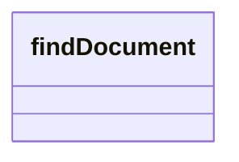

# findDocument

- **Diagram Type**: Logical
- **Package**: HomerSelect/BSL/Modules/Contract Management (COMA)/Interface Consumed/REST/DMS/v2/findDocument
- **Diagram ID**: 156389
- **Elements**: 1
- **Connectors**: 0

