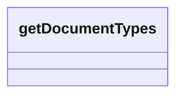

# getDocumentTypes

- **Diagram Type**: Logical
- **Package**: HomerSelect/BSL/Modules/Contract Management (COMA)/Interface Consumed/REST/DMS/v2/getDocumentTypes
- **Diagram ID**: 156391
- **Elements**: 1
- **Connectors**: 0

