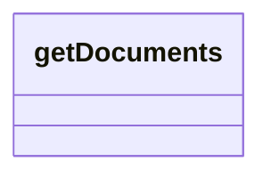

# getDocuments

- **Diagram Type**: Logical
- **Package**: HomerSelect/BSL/Modules/Contract Management (COMA)/Interface Consumed/REST/DMS/v2/getDocuments
- **Diagram ID**: 156390
- **Elements**: 1
- **Connectors**: 0

