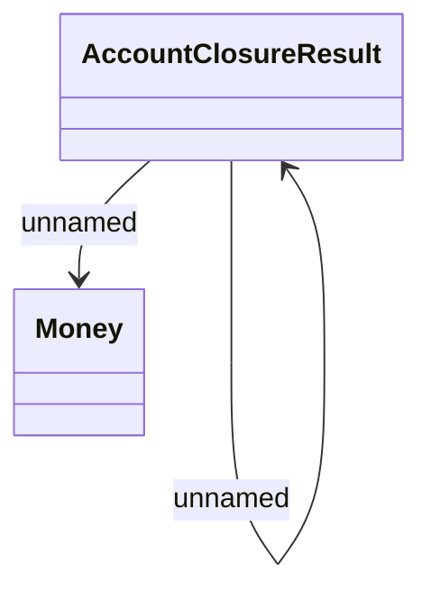

# ProcessAccountClosureResult

```mermaid
classDiagram
    class Money["Money"]
    class AccountClosureResult["AccountClosureResult"]
    class AccountClosureResult["AccountClosureResult"]
    AccountClosureResult --> AccountClosureResult : unnamed
    AccountClosureResult --> Money : unnamed
```
