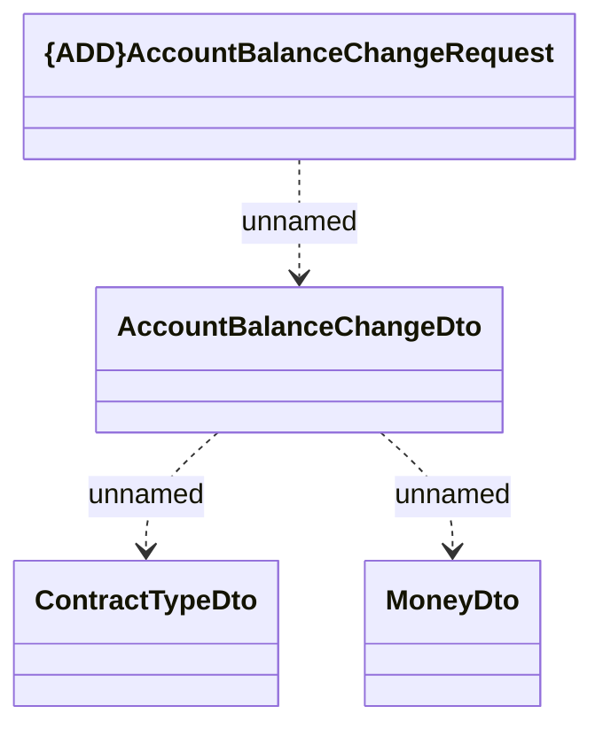

# {ADD}AccountBalanceChangeRequest

- **Diagram Type**: Logical
- **Package**: HomerSelect/BSL/Modules/Contract Management (COMA)/Interface Consumed/RabbitMQ/Debt catalogue/v4.0/AccountBalanceChangeRequest
- **Diagram ID**: 156229
- **Elements**: 4
- **Connectors**: 3

