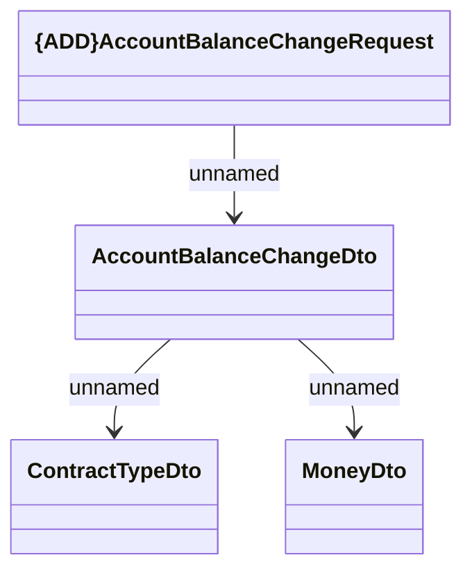

# {ADD}AccountBalanceChangeRequest

```mermaid
classDiagram
    class MoneyDto["MoneyDto"]
    class AccountBalanceChangeDto["AccountBalanceChangeDto"]
    class ContractTypeDto["ContractTypeDto"]
    class ADD_AccountBalanceChangeRequest["{ADD}AccountBalanceChangeRequest"]
    AccountBalanceChangeDto --> ContractTypeDto : unnamed
    ADD_AccountBalanceChangeRequest --> AccountBalanceChangeDto : unnamed
    AccountBalanceChangeDto --> MoneyDto : unnamed
```
