# ContractChangedEvent

- **Diagram Type**: Logical
- **Package**: HomerSelect/BSL/Modules/Contract Management (COMA)/Interface Provided/Kafka/Events/v1/Common
- **Diagram ID**: 164543
- **Elements**: 21
- **Connectors**: 22

```mermaid
classDiagram
    class ADD_ContractJointLender["{ADD}ContractJointLender"]
    class ADD_ContractOwner["{ADD}ContractOwner"]
    class Applicant["Applicant"]
    class ContractStatusTransitionUser["ContractStatusTransitionUser"]
    class ContractBusinessEventUser["ContractBusinessEventUser"]
    class ContractBusinessEventAttribute["ContractBusinessEventAttribute"]
    class ContractBusinessEvent["ContractBusinessEvent"]
    class ContractExtendedProperty["ContractExtendedProperty"]
    class ContractStatusTransitions["ContractStatusTransitions"]
    class ContractService["ContractService"]
    class ContractProduct["ContractProduct"]
    class ContractCustomer["ContractCustomer"]
    class ADD_ContractCommodity["{ADD}ContractCommodity"]
    class ContractRefinancedContract["ContractRefinancedContract"]
    class ADD_ContractAccount["{ADD}ContractAccount"]
    class MOD_ContractDocument["{MOD}ContractDocument"]
    class DEL_Document["{DEL}Document"]
    class ContractBefore["ContractBefore"]
    class Contract["Contract"]
    class ContractEvent["ContractEvent"]
    class ContractChangedEvent["ContractChangedEvent"]
    Contract --> ContractService : unnamed
    Contract ..> ADD_ContractOwner : unnamed
    Contract --> Applicant : unnamed
    ContractStatusTransitions --> ContractStatusTransitionUser : unnamed
    ContractStatusTransitions --> ContractStatusTransitionUser : unnamed
    ContractBusinessEvent --> ContractBusinessEventUser : unnamed
    ContractBusinessEvent --> ContractBusinessEventUser : unnamed
    ContractBusinessEvent --> ContractBusinessEventAttribute : unnamed
    Contract --> ContractBusinessEvent : unnamed
    Contract ..> ADD_ContractJointLender : unnamed
    Contract --> ContractStatusTransitions : unnamed
    ContractChangedEvent ..> ContractEvent : unnamed
    Contract --> ContractProduct : unnamed
    Contract --> ContractCustomer : unnamed
    Contract --> ADD_ContractCommodity : unnamed
    Contract --> ContractRefinancedContract : unnamed
    Contract --> ADD_ContractAccount : unnamed
    Contract --> MOD_ContractDocument : unnamed
    Contract --> DEL_Document : unnamed
    ContractEvent --> ContractBefore : unnamed
    ContractEvent --> Contract : unnamed
    Contract --> ContractExtendedProperty : unnamed
```

