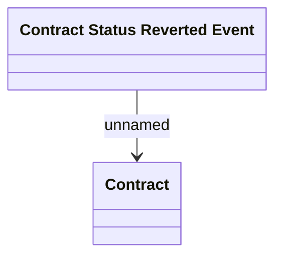

# Contract Status Reverted Event

```mermaid
classDiagram
    class Contract["Contract"]
    class Contract_Status_Reverted_Event["Contract Status Reverted Event"]
    Contract_Status_Reverted_Event --> Contract : unnamed
```
