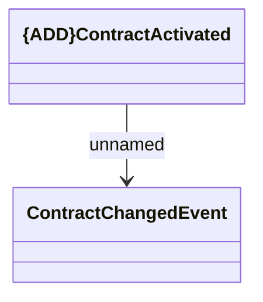

# {ADD}ContractActivated

```mermaid
classDiagram
    class ContractChangedEvent["ContractChangedEvent"]
    class ADD_ContractActivated["{ADD}ContractActivated"]
    ADD_ContractActivated --> ContractChangedEvent : unnamed
```
