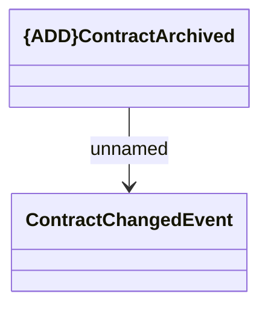

# ContractArchived

```mermaid
classDiagram
    class ContractChangedEvent["ContractChangedEvent"]
    class ADD_ContractArchived["{ADD}ContractArchived"]
    ADD_ContractArchived --> ContractChangedEvent : unnamed
```
