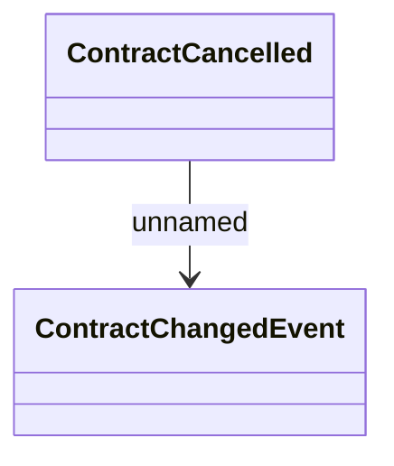

# ContractCancelled

```mermaid
classDiagram
    class ContractChangedEvent["ContractChangedEvent"]
    class ContractCancelled["ContractCancelled"]
    ContractCancelled --> ContractChangedEvent : unnamed
```
