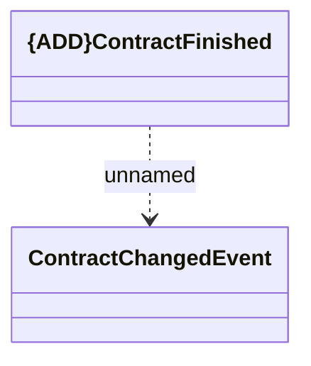

# ContractFinished

- **Diagram Type**: Logical
- **Package**: HomerSelect/BSL/Modules/Contract Management (COMA)/Interface Provided/Kafka/Events/v1/ContractFinished
- **Diagram ID**: 156394
- **Elements**: 2
- **Connectors**: 1

