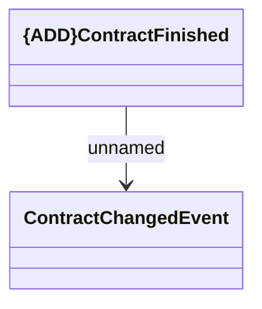

# ContractFinished

```mermaid
classDiagram
    class ContractChangedEvent["ContractChangedEvent"]
    class ADD_ContractFinished["{ADD}ContractFinished"]
    ADD_ContractFinished --> ContractChangedEvent : unnamed
```
