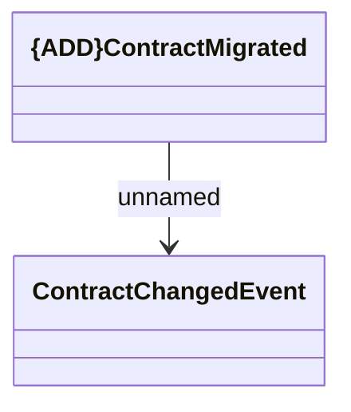

# ContractMigrated

```mermaid
classDiagram
    class ADD_ContractMigrated["{ADD}ContractMigrated"]
    class ContractChangedEvent["ContractChangedEvent"]
    ADD_ContractMigrated --> ContractChangedEvent : unnamed
```
