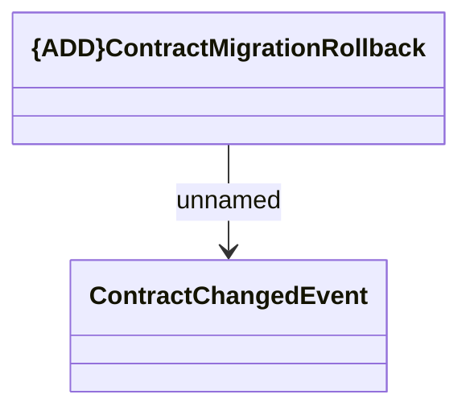

# ContractMigrationRollback

```mermaid
classDiagram
    class ADD_ContractMigrationRollback["{ADD}ContractMigrationRollback"]
    class ContractChangedEvent["ContractChangedEvent"]
    ADD_ContractMigrationRollback --> ContractChangedEvent : unnamed
```
