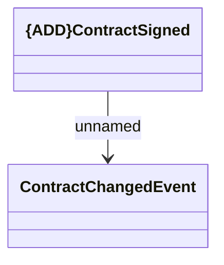

# {ADD}ContractSigned

```mermaid
classDiagram
    class ContractChangedEvent["ContractChangedEvent"]
    class ADD_ContractSigned["{ADD}ContractSigned"]
    ADD_ContractSigned --> ContractChangedEvent : unnamed
```
