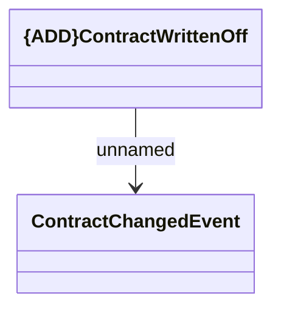

# {ADD}ContractWrittenOff

```mermaid
classDiagram
    class ContractChangedEvent["ContractChangedEvent"]
    class ADD_ContractWrittenOff["{ADD}ContractWrittenOff"]
    ADD_ContractWrittenOff --> ContractChangedEvent : unnamed
```
