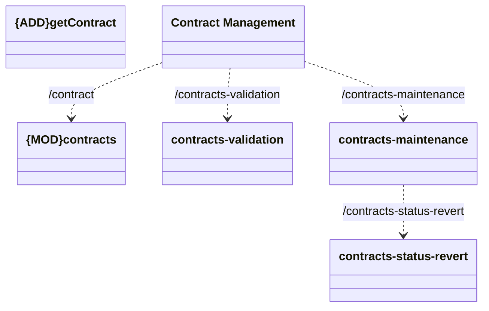

# REST

- **Diagram Type**: Logical
- **Package**: HomerSelect/BSL/Modules/Contract Management (COMA)/Interface Provided/REST/Application Interface Model
- **Diagram ID**: 156800
- **Elements**: 7
- **Connectors**: 4

