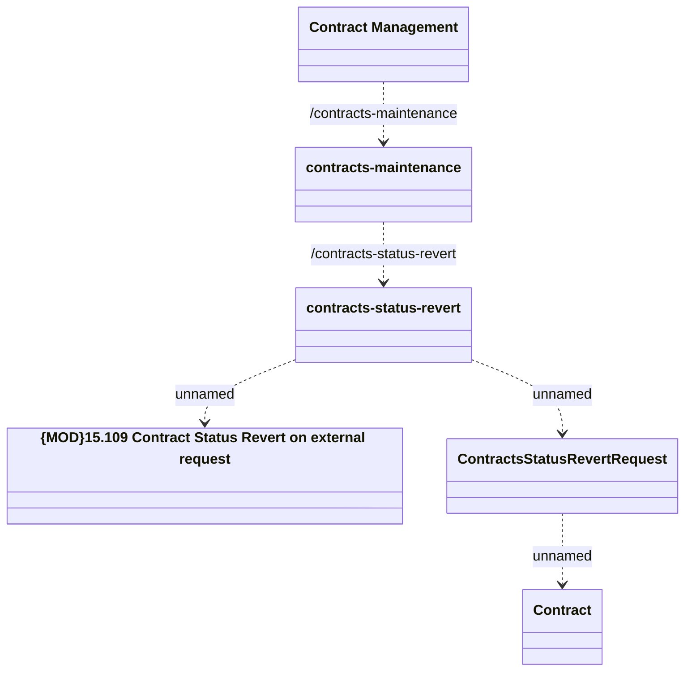

# Contracts Status Revert

- **Diagram Type**: Logical
- **Package**: HomerSelect/BSL/Modules/Contract Management (COMA)/Interface Provided/REST/Application Interface Model/Contracts Maintenance/v1/Contracts Status Revert
- **Diagram ID**: 156403
- **Elements**: 6
- **Connectors**: 5

