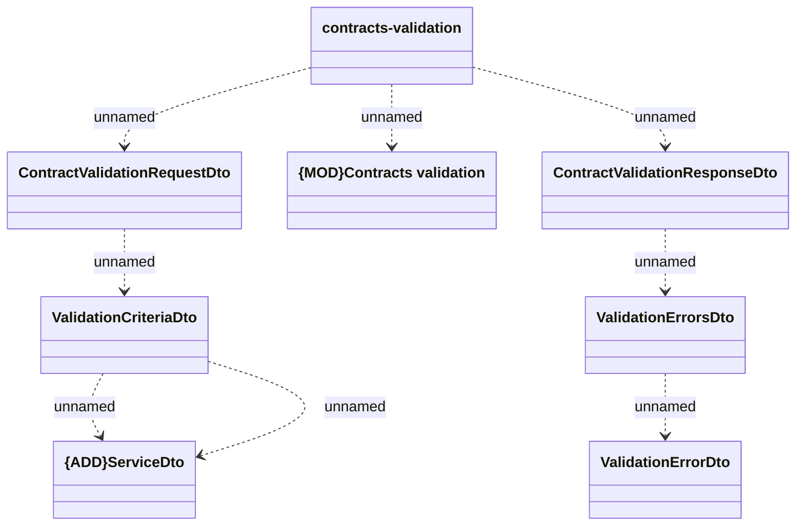

# Contracts validation

- **Diagram Type**: Logical
- **Package**: HomerSelect/BSL/Modules/Contract Management (COMA)/Interface Provided/REST/Application Interface Model/Contracts validation/v1/Contracts validation
- **Diagram ID**: 156252
- **Elements**: 8
- **Connectors**: 8

