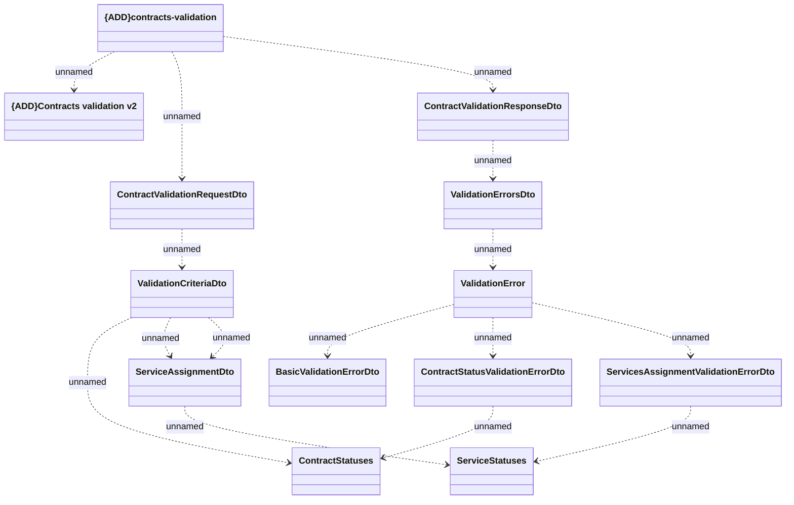

# Contracts validation

- **Diagram Type**: Logical
- **Package**: HomerSelect/BSL/Modules/Contract Management (COMA)/Interface Provided/REST/Application Interface Model/Contracts validation/v2/Contracts validation
- **Diagram ID**: 156254
- **Elements**: 13
- **Connectors**: 15

