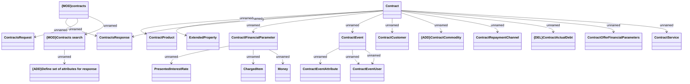

# searchContracts

```mermaid
classDiagram
    class MOD_Contracts_search["{MOD}Contracts search"]
    class ADD_ContractCommodity["{ADD}ContractCommodity"]
    class ContractsRequest["ContractsRequest"]
    class ContractRepaymentChannel["ContractRepaymentChannel"]
    class DEL_ContractActualDebt["{DEL}ContractActualDebt"]
    class ContractOfferFinancialParameters["ContractOfferFinancialParameters"]
    class ContractService["ContractService"]
    class ContractEventUser["ContractEventUser"]
    class Money["Money"]
    class ContractProduct["ContractProduct"]
    class ContractCustomer["ContractCustomer"]
    class MOD_contracts["{MOD}contracts"]
    class ExtendedProperty["ExtendedProperty"]
    class PresentedInterestRate["PresentedInterestRate"]
    class ContractsResponse["ContractsResponse"]
    class ContractlFinancialParameter["ContractlFinancialParameter"]
    class ContractEventAttribute["ContractEventAttribute"]
    class ContractEvent["ContractEvent"]
    class Contract["Contract"]
    class ADD_Define_set_of_attributes_for_response["{ADD}Define set of attributes for response"]
    class ChargedItem["ChargedItem"]
    ContractEvent --> ContractEventUser : unnamed
    ContractlFinancialParameter --> Money : unnamed
    MOD_contracts --> MOD_Contracts_search : unnamed
    ContractEvent --> ContractEventUser : unnamed
    Contract --> ContractService : unnamed
    Contract --> ContractOfferFinancialParameters : unnamed
    Contract --> DEL_ContractActualDebt : unnamed
    Contract --> ContractRepaymentChannel : unnamed
    MOD_contracts --> ContractsRequest : unnamed
    Contract --> ADD_ContractCommodity : unnamed
    Contract --> ContractCustomer : unnamed
    Contract --> ContractEvent : unnamed
    ContractEvent --> ContractEventAttribute : unnamed
    Contract --> ContractlFinancialParameter : unnamed
    MOD_contracts --> ContractsResponse : unnamed
    Contract --> ContractsResponse : unnamed
    Contract --> ExtendedProperty : unnamed
    Contract --> ContractProduct : unnamed
    ContractlFinancialParameter --> ChargedItem : unnamed
    ContractlFinancialParameter --> PresentedInterestRate : unnamed
    MOD_Contracts_search --> ADD_Define_set_of_attributes_for_response : unnamed
```
