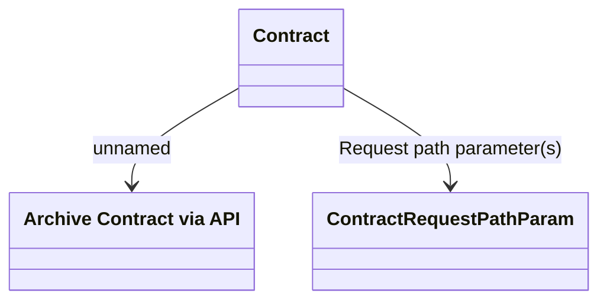

# archiveContract

```mermaid
classDiagram
    class ContractRequestPathParam["ContractRequestPathParam"]
    class Contract["Contract"]
    class Archive_Contract_via_API["Archive Contract via API"]
    Contract --> Archive_Contract_via_API : unnamed
    Contract --> ContractRequestPathParam : Request path parameter(s)
```
