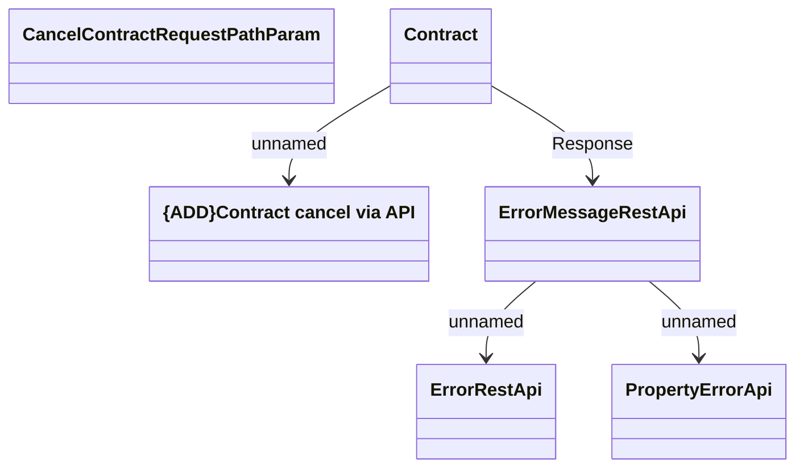

# cancelContract

```mermaid
classDiagram
    class ADD_Contract_cancel_via_API["{ADD}Contract cancel via API"]
    class CancelContractRequestPathParam["CancelContractRequestPathParam"]
    class Contract["Contract"]
    class PropertyErrorApi["PropertyErrorApi"]
    class ErrorRestApi["ErrorRestApi"]
    class ErrorMessageRestApi["ErrorMessageRestApi"]
    ErrorMessageRestApi --> ErrorRestApi : unnamed
    Contract --> ADD_Contract_cancel_via_API : unnamed
    Contract --> ErrorMessageRestApi : Response
    ErrorMessageRestApi --> PropertyErrorApi : unnamed
```
