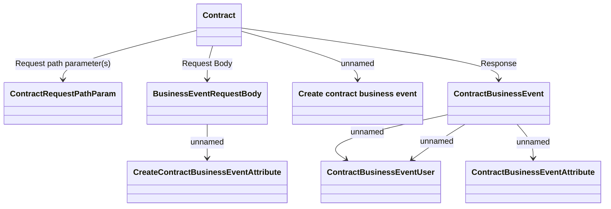

# createBusinessEvent

```mermaid
classDiagram
    class ContractRequestPathParam["ContractRequestPathParam"]
    class BusinessEventRequestBody["BusinessEventRequestBody"]
    class Contract["Contract"]
    class Create_contract_business_event["Create contract business event"]
    class CreateContractBusinessEventAttribute["CreateContractBusinessEventAttribute"]
    class ContractBusinessEventAttribute["ContractBusinessEventAttribute"]
    class ContractBusinessEventUser["ContractBusinessEventUser"]
    class ContractBusinessEvent["ContractBusinessEvent"]
    BusinessEventRequestBody --> CreateContractBusinessEventAttribute : unnamed
    ContractBusinessEvent --> ContractBusinessEventUser : unnamed
    ContractBusinessEvent --> ContractBusinessEventUser : unnamed
    ContractBusinessEvent --> ContractBusinessEventAttribute : unnamed
    Contract --> BusinessEventRequestBody : Request Body
    Contract --> ContractBusinessEvent : Response
    Contract --> Create_contract_business_event : unnamed
    Contract --> ContractRequestPathParam : Request path parameter(s)
```
