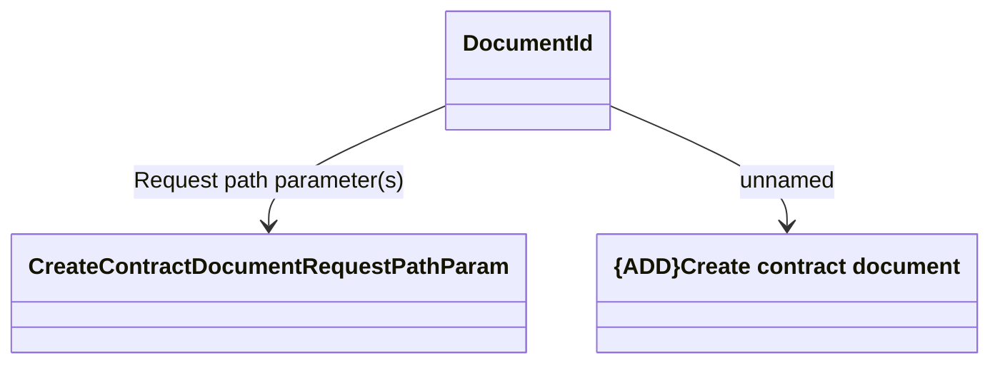

# createContractDocument

```mermaid
classDiagram
    class CreateContractDocumentRequestPathParam["CreateContractDocumentRequestPathParam"]
    class DocumentId["DocumentId"]
    class ADD_Create_contract_document["{ADD}Create contract document"]
    DocumentId --> CreateContractDocumentRequestPathParam : Request path parameter(s)
    DocumentId --> ADD_Create_contract_document : unnamed
```
