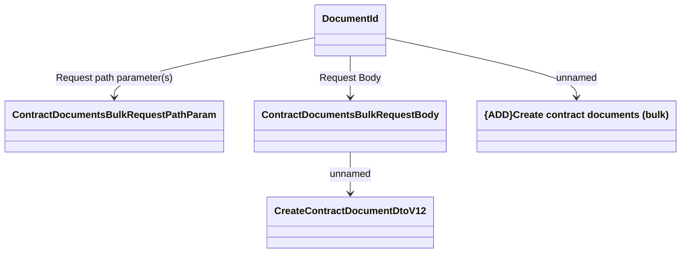

# createContractDocuments

```mermaid
classDiagram
    class ContractDocumentsBulkRequestPathParam["ContractDocumentsBulkRequestPathParam"]
    class CreateContractDocumentDtoV12["CreateContractDocumentDtoV12"]
    class ContractDocumentsBulkRequestBody["ContractDocumentsBulkRequestBody"]
    class DocumentId["DocumentId"]
    class ADD_Create_contract_documents_bulk["{ADD}Create contract documents (bulk)"]
    ContractDocumentsBulkRequestBody --> CreateContractDocumentDtoV12 : unnamed
    DocumentId --> ContractDocumentsBulkRequestBody : Request Body
    DocumentId --> ContractDocumentsBulkRequestPathParam : Request path parameter(s)
    DocumentId --> ADD_Create_contract_documents_bulk : unnamed
```
