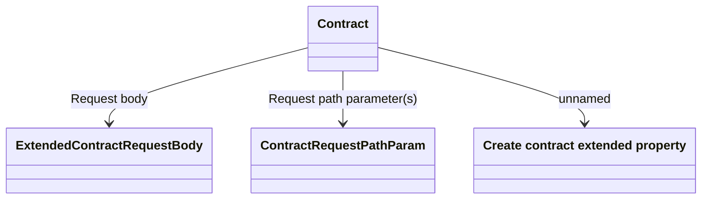

# createContractExtendedProperty

```mermaid
classDiagram
    class ExtendedContractRequestBody["ExtendedContractRequestBody"]
    class ContractRequestPathParam["ContractRequestPathParam"]
    class Contract["Contract"]
    class Create_contract_extended_property["Create contract extended property"]
    Contract --> ExtendedContractRequestBody : Request body
    Contract --> ContractRequestPathParam : Request path parameter(s)
    Contract --> Create_contract_extended_property : unnamed
```
