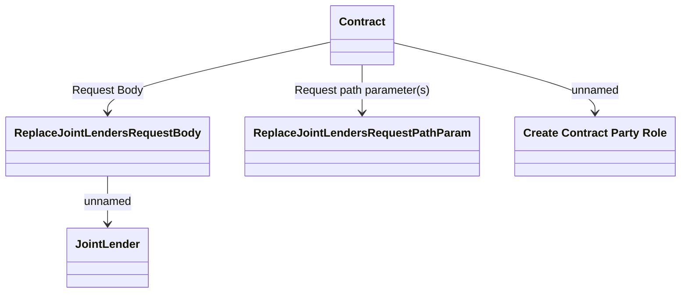

# createContractJointLenders

```mermaid
classDiagram
    class ReplaceJointLendersRequestBody["ReplaceJointLendersRequestBody"]
    class JointLender["JointLender"]
    class ReplaceJointLendersRequestPathParam["ReplaceJointLendersRequestPathParam"]
    class Contract["Contract"]
    class Create_Contract_Party_Role["Create Contract Party Role"]
    ReplaceJointLendersRequestBody --> JointLender : unnamed
    Contract --> ReplaceJointLendersRequestPathParam : Request path parameter(s)
    Contract --> ReplaceJointLendersRequestBody : Request Body
    Contract --> Create_Contract_Party_Role : unnamed
```
