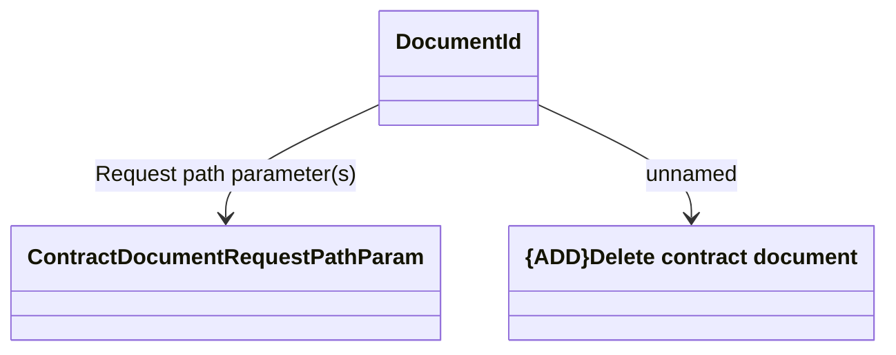

# deleteContractDocument

```mermaid
classDiagram
    class DocumentId["DocumentId"]
    class ContractDocumentRequestPathParam["ContractDocumentRequestPathParam"]
    class ADD_Delete_contract_document["{ADD}Delete contract document"]
    DocumentId --> ContractDocumentRequestPathParam : Request path parameter(s)
    DocumentId --> ADD_Delete_contract_document : unnamed
```
