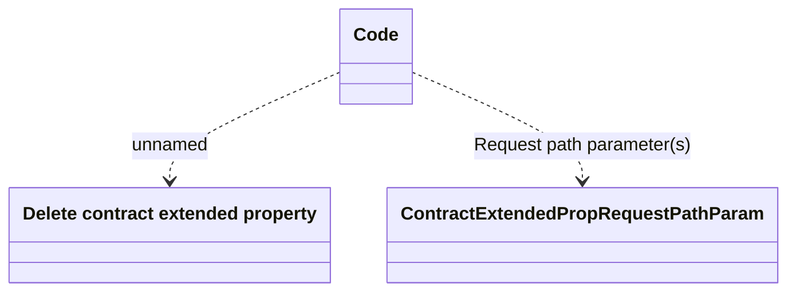

# deleteContractExtendedProperty

- **Diagram Type**: Logical
- **Package**: HomerSelect/BSL/Modules/Contract Management (COMA)/Interface Provided/REST/Application Interface Model/Contracts/v12/deleteContractExtendedProperty
- **Diagram ID**: 160406
- **Elements**: 3
- **Connectors**: 2

