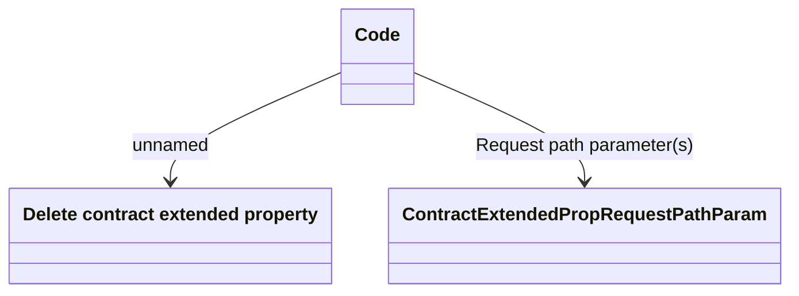

# deleteContractExtendedProperty

```mermaid
classDiagram
    class ContractExtendedPropRequestPathParam["ContractExtendedPropRequestPathParam"]
    class Code["Code"]
    class Delete_contract_extended_property["Delete contract extended property"]
    Code --> Delete_contract_extended_property : unnamed
    Code --> ContractExtendedPropRequestPathParam : Request path parameter(s)
```
