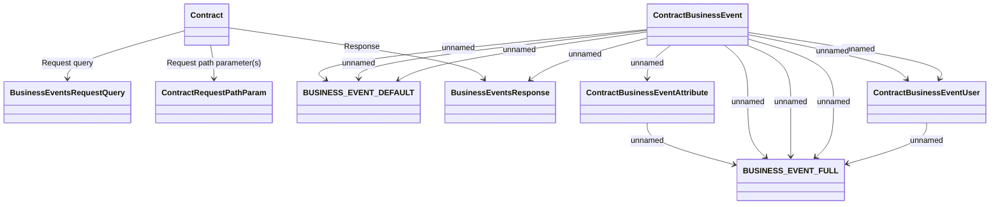

# getBusinessEvents

```mermaid
classDiagram
    class BusinessEventsRequestQuery["BusinessEventsRequestQuery"]
    class ContractRequestPathParam["ContractRequestPathParam"]
    class Contract["Contract"]
    class BUSINESS_EVENT_FULL["BUSINESS_EVENT_FULL"]
    class BUSINESS_EVENT_DEFAULT["BUSINESS_EVENT_DEFAULT"]
    class BusinessEventsResponse["BusinessEventsResponse"]
    class ContractBusinessEventAttribute["ContractBusinessEventAttribute"]
    class ContractBusinessEventUser["ContractBusinessEventUser"]
    class ContractBusinessEvent["ContractBusinessEvent"]
    ContractBusinessEvent --> BusinessEventsResponse : unnamed
    ContractBusinessEventUser --> BUSINESS_EVENT_FULL : unnamed
    ContractBusinessEvent --> ContractBusinessEventUser : unnamed
    ContractBusinessEvent --> ContractBusinessEventUser : unnamed
    ContractBusinessEvent --> BUSINESS_EVENT_DEFAULT : unnamed
    ContractBusinessEvent --> BUSINESS_EVENT_DEFAULT : unnamed
    ContractBusinessEvent --> BUSINESS_EVENT_FULL : unnamed
    ContractBusinessEvent --> ContractBusinessEventAttribute : unnamed
    ContractBusinessEvent --> BUSINESS_EVENT_FULL : unnamed
    ContractBusinessEvent --> BUSINESS_EVENT_FULL : unnamed
    ContractBusinessEvent --> BUSINESS_EVENT_DEFAULT : unnamed
    ContractBusinessEventAttribute --> BUSINESS_EVENT_FULL : unnamed
    Contract --> BusinessEventsResponse : Response
    Contract --> BusinessEventsRequestQuery : Request query
    Contract --> ContractRequestPathParam : Request path parameter(s)
```
