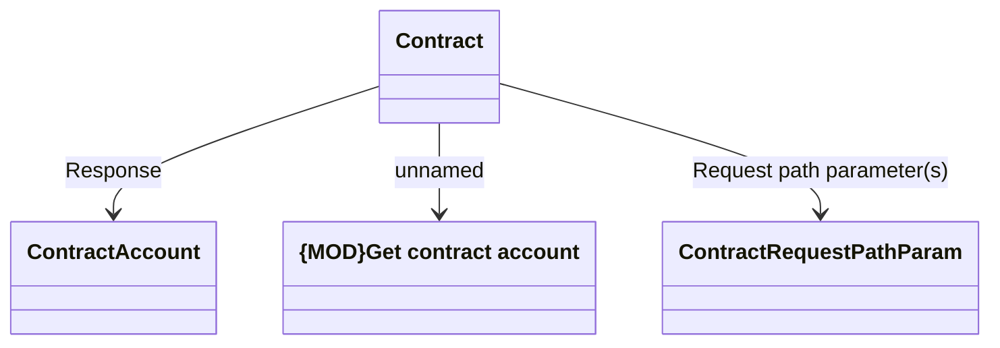

# getContractAccount

```mermaid
classDiagram
    class ContractAccount["ContractAccount"]
    class ContractRequestPathParam["ContractRequestPathParam"]
    class Contract["Contract"]
    class MOD_Get_contract_account["{MOD}Get contract account"]
    Contract --> ContractAccount : Response
    Contract --> MOD_Get_contract_account : unnamed
    Contract --> ContractRequestPathParam : Request path parameter(s)
```
