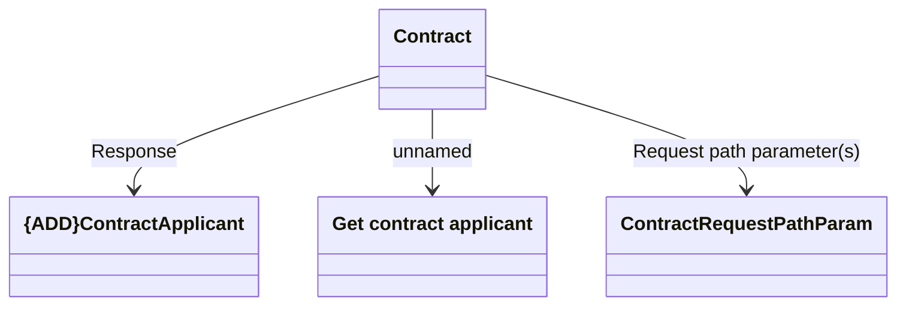

# getContractApplicant

```mermaid
classDiagram
    class ContractRequestPathParam["ContractRequestPathParam"]
    class Contract["Contract"]
    class ADD_ContractApplicant["{ADD}ContractApplicant"]
    class Get_contract_applicant["Get contract applicant"]
    Contract --> ADD_ContractApplicant : Response
    Contract --> Get_contract_applicant : unnamed
    Contract --> ContractRequestPathParam : Request path parameter(s)
```
