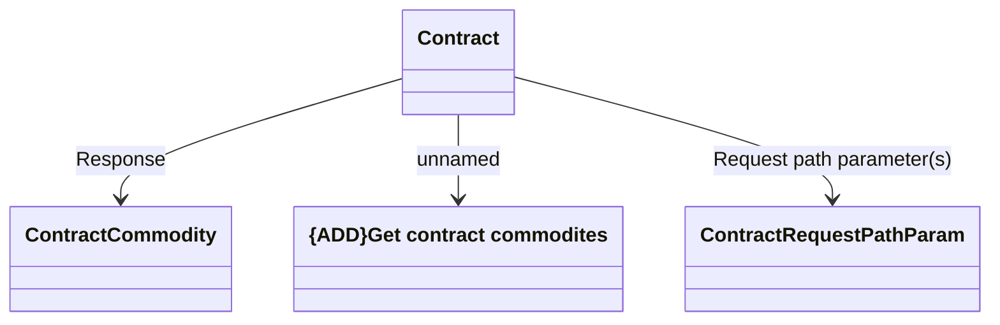

# getContractCommodities

```mermaid
classDiagram
    class ContractRequestPathParam["ContractRequestPathParam"]
    class Contract["Contract"]
    class ADD_Get_contract_commodites["{ADD}Get contract commodites"]
    class ContractCommodity["ContractCommodity"]
    Contract --> ContractCommodity : Response
    Contract --> ADD_Get_contract_commodites : unnamed
    Contract --> ContractRequestPathParam : Request path parameter(s)
```
