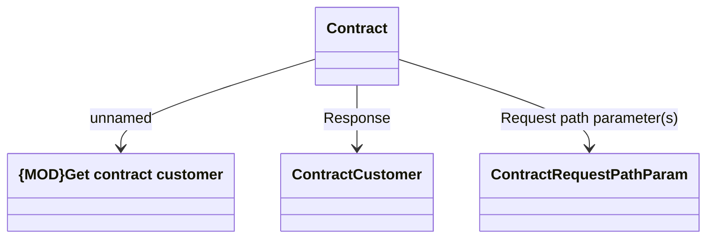

# getContractCustomer

```mermaid
classDiagram
    class ContractRequestPathParam["ContractRequestPathParam"]
    class Contract["Contract"]
    class ContractCustomer["ContractCustomer"]
    class MOD_Get_contract_customer["{MOD}Get contract customer"]
    Contract --> MOD_Get_contract_customer : unnamed
    Contract --> ContractCustomer : Response
    Contract --> ContractRequestPathParam : Request path parameter(s)
```
