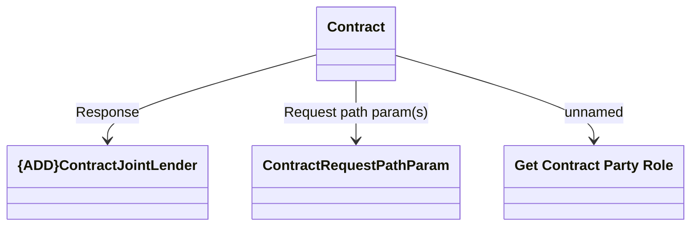

# getContractJointLenders

```mermaid
classDiagram
    class ContractRequestPathParam["ContractRequestPathParam"]
    class Contract["Contract"]
    class ADD_ContractJointLender["{ADD}ContractJointLender"]
    class Get_Contract_Party_Role["Get Contract Party Role"]
    Contract --> ADD_ContractJointLender : Response
    Contract --> ContractRequestPathParam : Request path param(s)
    Contract --> Get_Contract_Party_Role : unnamed
```
