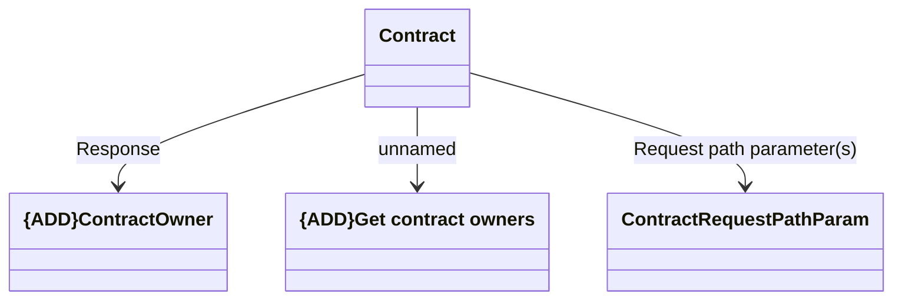

# getContractOwners

```mermaid
classDiagram
    class ContractRequestPathParam["ContractRequestPathParam"]
    class Contract["Contract"]
    class ADD_ContractOwner["{ADD}ContractOwner"]
    class ADD_Get_contract_owners["{ADD}Get contract owners"]
    Contract --> ADD_ContractOwner : Response
    Contract --> ADD_Get_contract_owners : unnamed
    Contract --> ContractRequestPathParam : Request path parameter(s)
```
