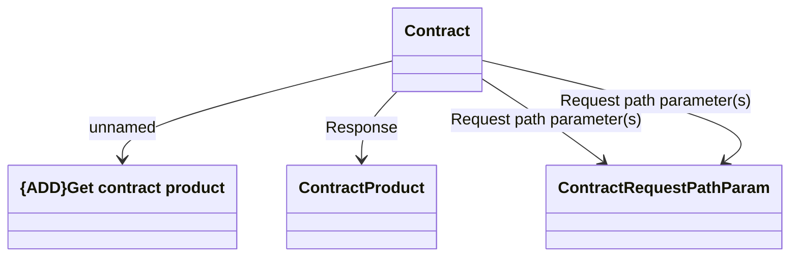

# getContractProduct

```mermaid
classDiagram
    class ContractRequestPathParam["ContractRequestPathParam"]
    class Contract["Contract"]
    class ContractProduct["ContractProduct"]
    class ADD_Get_contract_product["{ADD}Get contract product"]
    Contract --> ADD_Get_contract_product : unnamed
    Contract --> ContractProduct : Response
    Contract --> ContractRequestPathParam : Request path parameter(s)
    Contract --> ContractRequestPathParam : Request path parameter(s)
```
