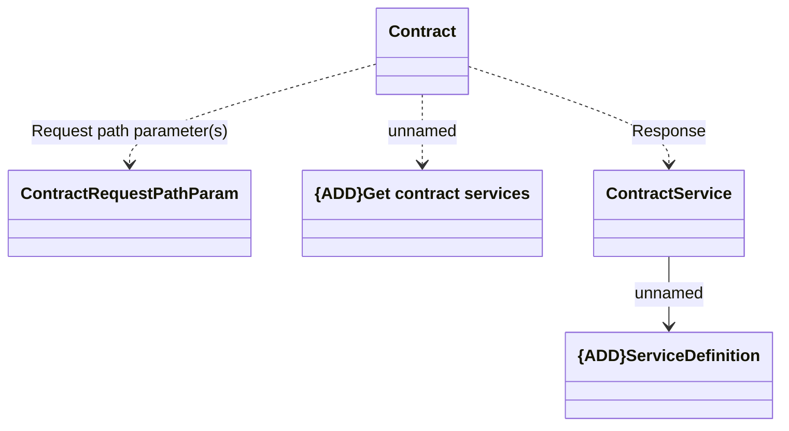

# getContractServices

- **Diagram Type**: Logical
- **Package**: HomerSelect/BSL/Modules/Contract Management (COMA)/Interface Provided/REST/Application Interface Model/Contracts/v12/getContractServices
- **Diagram ID**: 160415
- **Elements**: 5
- **Connectors**: 4

