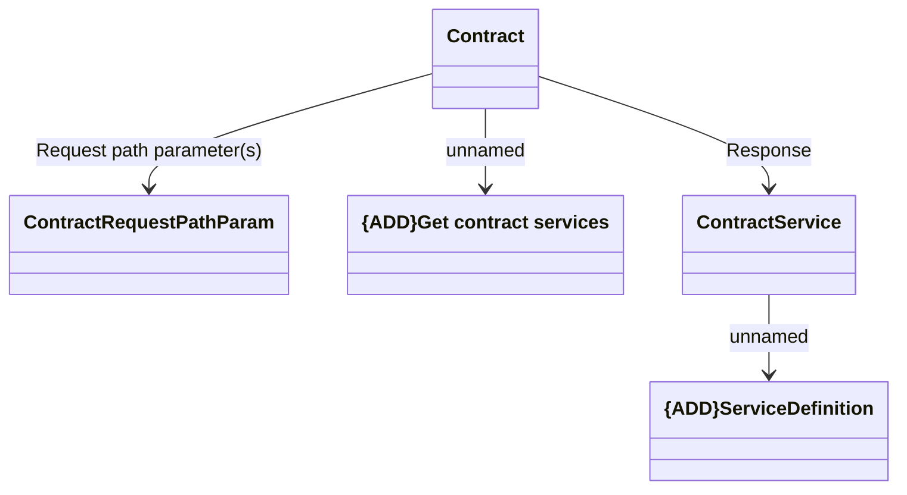

# getContractServices

```mermaid
classDiagram
    class ContractRequestPathParam["ContractRequestPathParam"]
    class Contract["Contract"]
    class ADD_ServiceDefinition["{ADD}ServiceDefinition"]
    class ADD_Get_contract_services["{ADD}Get contract services"]
    class ContractService["ContractService"]
    Contract --> ContractService : Response
    Contract --> ContractRequestPathParam : Request path parameter(s)
    Contract --> ADD_Get_contract_services : unnamed
    ContractService --> ADD_ServiceDefinition : unnamed
```
