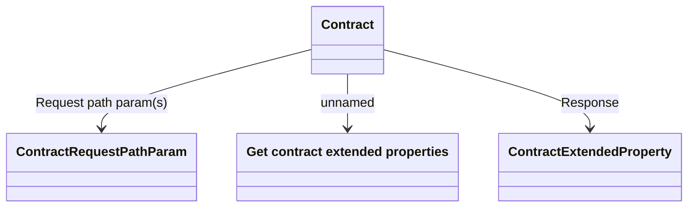

# getExtendedProperties

```mermaid
classDiagram
    class ContractRequestPathParam["ContractRequestPathParam"]
    class Get_contract_extended_properties["Get contract extended properties"]
    class Contract["Contract"]
    class ContractExtendedProperty["ContractExtendedProperty"]
    Contract --> ContractRequestPathParam : Request path param(s)
    Contract --> Get_contract_extended_properties : unnamed
    Contract --> ContractExtendedProperty : Response
```
